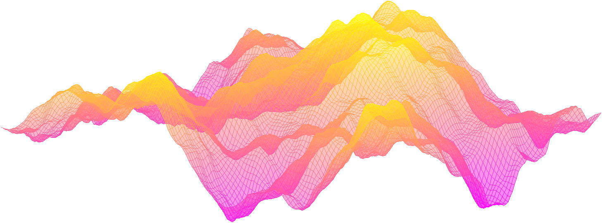

---
# Leave the homepage title empty to use the site title
title: ""
date: 2022-10-24
type: landing

design:
  # Default section spacing
  spacing: "6rem"

sections:
  - block: resume-biography-3
    content:
      # Choose a user profile to display (a folder name within `content/authors/`)
      username: admin
      text: ""
      # Show a call-to-action button under your biography? (optional)
      button:
        text: Download CV
        url: uploads/resume.pdf
    design:
      css_class: dark
      background:
        color: black
        image:
          # Add your image background to `assets/media/`.
          filename: stacked-peaks.svg
          filters:
            brightness: 1.0
          size: cover
          position: center
          parallax: false
  - block: markdown
    content:
      title: '📚 My Research'
      subtitle: ''
      text: |-
        
        I am working in the field of randomly fluctuating interfaces, which arises naturally in the context of coexistence of two homogeneous phases and is studied in a variety of statistical mechanics models describing both the phases and their interface.\
        I am currently working on the Gaussian free field in random environment with [Alberto Chiarini](https://www.math.unipd.it/~chiarini/).
        
        Please reach out to collaborate 😃
    design:
      columns: '1'
  - block: markdown
    id: travels
    content:
      title: '🧳 Upcoming travels (as of May 2025)'
      subtitle: ''
      text: |-
        I will attend the following
        - May 05-09, 2025. [Conference on Mixing Times between Probability, Computer Science and Statistical Physics](https://indico.ictp.it/event/10831), ICTP, Trieste, Italy.
        - June 30-July 4, 2025. [Random Geometric Structures and Statistical Physics workshop](https://sites.google.com/view/random-geometric-structures/home?pli=1), Sapienza University of Rome, Italy.

        Some past contributions
        - February 17-28, 2025. Poster at the Winter school on Statistical Mechanics, Nonequilibrium Processes and Probability, Sapienza University of Rome, Italy.
        - June 17, 2024. Poster at Workshop on Probabilistic Field Theories, Aalto University, Espoo, Finland.
        - September 10-12, 2024. Poster at Particle Systems and PDE’s XII, University of Trieste, Italy.

        Some more past travels
        - April 11, 2025. A Spring Day in Probability and Statistical Physics, University of Florence, Italy.
        - September 23-27, 2024. Long-range phenomena in Percolation, University of Cologne, Germany.
        - September 18-20, 2024. Large scale behaviour of interacting diffusions: from stochastic control to functional inequalities, University of Padua, Italy.
        - April 19, 2024. A Spring Day in Probability and Statistical Physics, University of Florence, Italy.
        - June 10-14, 2024. 4th Italian Meeting on Probability and Mathematical Statistics, Sapienza University of Rome, Italy.
    design:
      columns: '1'
#  - block: collection
#    id: papers
#    content:
#      title: Featured Publications
#      filters:
#        folders:
#          - publication
#        featured_only: true
#    design:
#      view: article-grid
#      columns: 2
#  - block: collection
#    content:
#      title: Recent Publications
#      text: ""
#      filters:
#        folders:
#          - publication
#        exclude_featured: false
#    design:
#      view: citation
#  - block: collection
#    id: talks
#    content:
#      title: Recent & Upcoming Talks
#      filters:
#        folders:
#          - event
#    design:
#      view: article-grid
#      columns: 1
#  - block: collection
#    id: travels
#    content:
#      title: Upcoming travels (as of May 2025)
#      filters:
#        folders:
#          - travel_upcoming
#    design:
#      view: article-grid
#      columns: 1
#  - block: collection
#    id: news
#    content:
#      title: Recent News
#      subtitle: ''
#      text: ''
#      # Page type to display. E.g. post, talk, publication...
#      page_type: post
#      # Choose how many pages you would like to display (0 = all pages)
#      count: 5
#      # Filter on criteria
#      filters:
#        author: ""
#        category: ""
#        tag: ""
#        exclude_featured: false
#        exclude_future: false
#        exclude_past: false
#        publication_type: ""
#      # Choose how many pages you would like to offset by
#      offset: 0
#      # Page order: descending (desc) or ascending (asc) date.
#      order: desc
#    design:
#      # Choose a layout view
#      view: date-title-summary
#      # Reduce spacing
#      spacing:
#        padding: [0, 0, 0, 0]
#  - block: cta-card
#    demo: true # Only display this section in the Hugo Blox Builder demo site
#    content:
#      title: 👉 Build your own academic website like this
#      text: |-
#        This site is generated by Hugo Blox Builder - the FREE, Hugo-based open source website builder trusted by 250,000+ academics like you.
#
#        <a class="github-button" href="https://github.com/HugoBlox/hugo-blox-builder" data-color-scheme="no-preference: light; light: light; dark: dark;" data-icon="octicon-star" data-size="large" data-show-count="true" aria-label="Star HugoBlox/hugo-blox-builder on GitHub">Star</a>
#
#        Easily build anything with blocks - no-code required!
#        
#        From landing pages, second brains, and courses to academic resumés, conferences, and tech blogs.
#      button:
#        text: Get Started
#        url: https://hugoblox.com/templates/
#    design:
#      card:
#        # Card background color (CSS class)
#        css_class: "bg-primary-700"
#        css_style: ""
---
